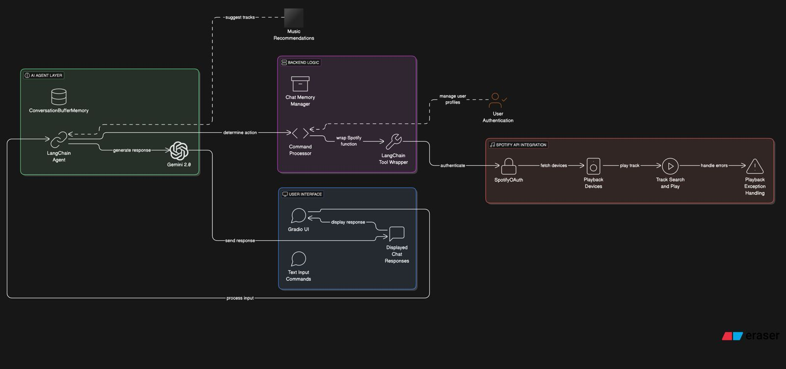
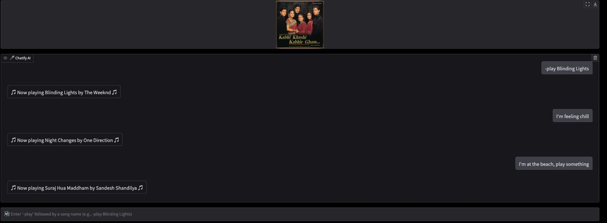
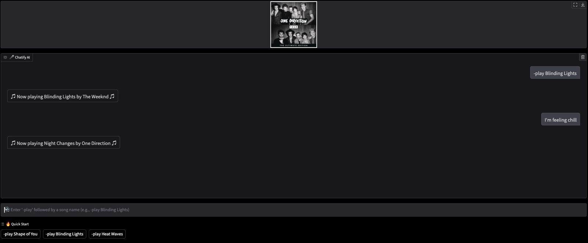

# 🎧 Chatify - AI Powered Spotify Music Assistant

> Your **smart music companion** – powered by **Gemini 2.0**, **LangChain**, and **Spotify API** 🎶  
> Play music by **mood**, **voice**, or **track name** – right from a chatbot interface.


---

## 🚀 Features

- 🎵 **Play any song** from Spotify by typing `-play <song name>`
- 😎 **AI-based mood detection** like "I'm feeling chill" or "play something happy"
- 🧠 **Conversational memory** using LangChain’s `ConversationBufferMemory`
- 💬 **ChatGPT/Gemini 2.0** integrated for general chat
- 📻 **Now Playing UI** with album cover
- 🧰 Built with **Gradio**, **LangChain**, and **SpotifyOAuth**
- 🧩 **Chrome Extension** support to run the app in your browser toolbar

---

## 🧠 Architecture



---

## 🌈 User Interface Preview

### 🎤 Chatify AI in Action  
  


---

## 🛠️ Tech Stack

| Layer         | Stack Used                     |
|---------------|--------------------------------|
| 💡 AI Model   | Gemini 2.0 via OpenRouter      |
| 🔗 LangChain  | AgentExecutor, Tools, Memory   |
| 🎛 Spotify API| `spotipy`, SpotifyOAuth        |
| 🧠 Memory     | ConversationBufferMemory       |
| 🎨 UI         | Gradio + Custom CSS            |
| 🌐 Extension  | Chrome Manifest v3             |

---

## 🧪 How to Use Locally

### ⚙️ Setup

1. Clone the repo:
   ```bash
   git clone https://github.com/Nanthan-s-Nair/Chatify.git
   cd Chatify
   ```

2. Install dependencies:
   ```bash
   pip install -r requirements.txt
   ```

3. Add your API keys:
   - **Spotify** `CLIENT_ID`, `CLIENT_SECRET`, and `REDIRECT_URI`
   - **OpenRouter API key** (for Gemini 2.0)

4. Run the app:
   ```bash
   python app.py
   ```

---

## 🧩 Using as Chrome Extension

1. Navigate to `chrome://extensions/`  
2. Enable **Developer Mode**
3. Click **Load Unpacked** and select the `chrome-extension` folder
4. Chatify will be added to your browser bar 🚀

To let others download:
- Create a `.zip` of the `chrome-extension` folder and host it on your website  
- Add a **Download Extension** button with the `.zip` link


---

## 📌 Commands

| Command                | Action                                 |
|------------------------|----------------------------------------|
| `-play <song>`         | Plays the specified track              |
| `"I'm feeling sad"`    | Suggests and plays mood-based music    |
| `"Play something happy"` | AI detects mood and responds          |
| `Normal text`          | Gemini 2.0 responds via chat           |

---

## 🤖 Example Prompts

- `-play Shape of You`
- `I'm at the beach, play something`
- `Suggest me a chill song`
- `Tell me a joke`

---

## 🧠 Memory-Powered Conversations

This app uses LangChain's `ConversationBufferMemory` so it remembers your past prompts during a session, enabling **contextual interactions**.

---

## 🛡 Disclaimer

> This app requires a **Spotify Premium account** to actually play tracks via the API.  
> If you're using someone else's credentials, make sure to **never expose the keys** publicly (use `.env` for safety).

---

## 📜 License

This project is licensed under [MIT](./LICENSE)
